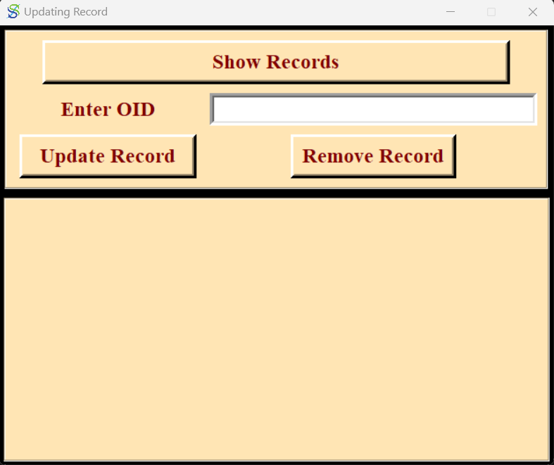
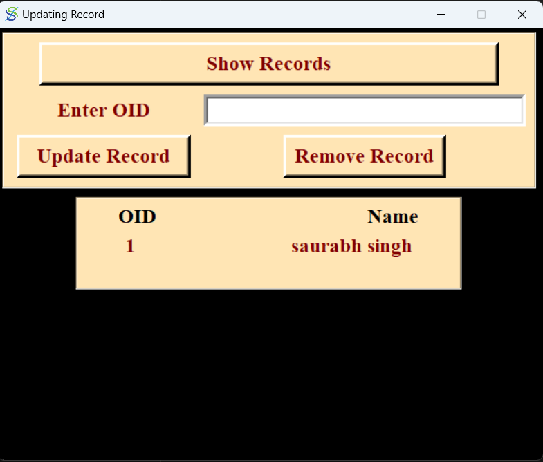
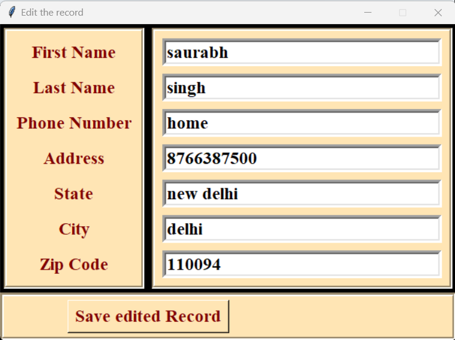

# AddressBook using python
this is a simple application i built using python and tkinter for GUI. It consist of several functions including adding new addresses, upodating the records or showing all the existing records.

### Home page
This page consists of several fields to fill and store address by default all the fields are mandatory but it can be changed as per the requirements.

### updation window
this window has several options including show records,update record,remove record.
#### 1

#### 2
After clicking on show records this interface shows that shows the oid and name of the person.

### Edit the Record
After entering the oid of the user and clicking on update record this window pops up to take updation and a button to save the updated values

